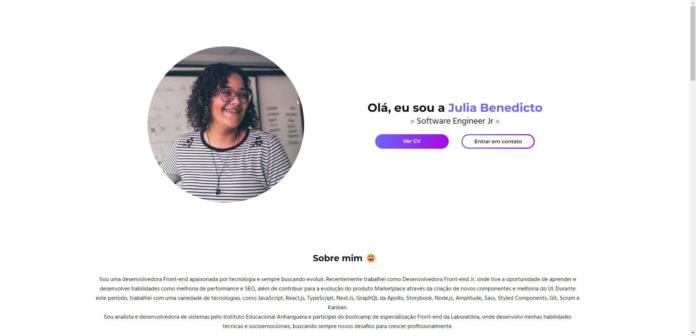

<h1 align="center">Portifólio - Julia Benedicto 💻</h1>



<h4 align="center"><a target="_blank" href="https://juliabenedicto.netlify.app/">Confira o projeto aqui</a></h4>

---

## 💻 Sobre

Projeto feito no intuito de me apresentar, como desenvolvedora front-end.

## 🤯 O site é composto por:

- **Início:** Minha apresentação;
- **Sobre mim:** Falo um pouco sobre minha trajetória;
- **Habilidades:** As tecnologias que tenho conhecimento;
- **Destaques:** Alguns projetos recentes que fiz;
- **Contato:** Meios para contato;
- **Projetos:** Lista com todos os projetos (que podem ser acessados/testados).

## 👩‍💻 Tecnologias utilizadas:

O site **ainda está em desenvolvimento**, pois estou em constante aprendizado e melhorando o projeto com o tempo. Mas até aqui utilizei:

<div>
    
    
  
    
     
          
     
</div>

---

<table>
  <tr>
    <td>
      
    </td>
    <td>
      Feito por <a href="https://github.com/juliabb">Julia Benedicto.</a> 👩
    </td>
  </tr>
</table>

---

## 📅 Atualizações futuras
- Adição do Header
- Footer
- Toggle para mudar o tema (claro e escuro)

Caso encontre algum bug ou tenha uma sugestão entre em contato 🙂 Toda ajuda é bem vinda

---

### 🚶‍♀️ Para rodar o projeto siga o passo a passo

## Getting Started

First, run the development server:

```bash
npm run dev
# or
yarn dev
# or
pnpm dev
```

Open [http://localhost:3000](http://localhost:3000) with your browser to see the result.

You can start editing the page by modifying `pages/index.tsx`. The page auto-updates as you edit the file.
